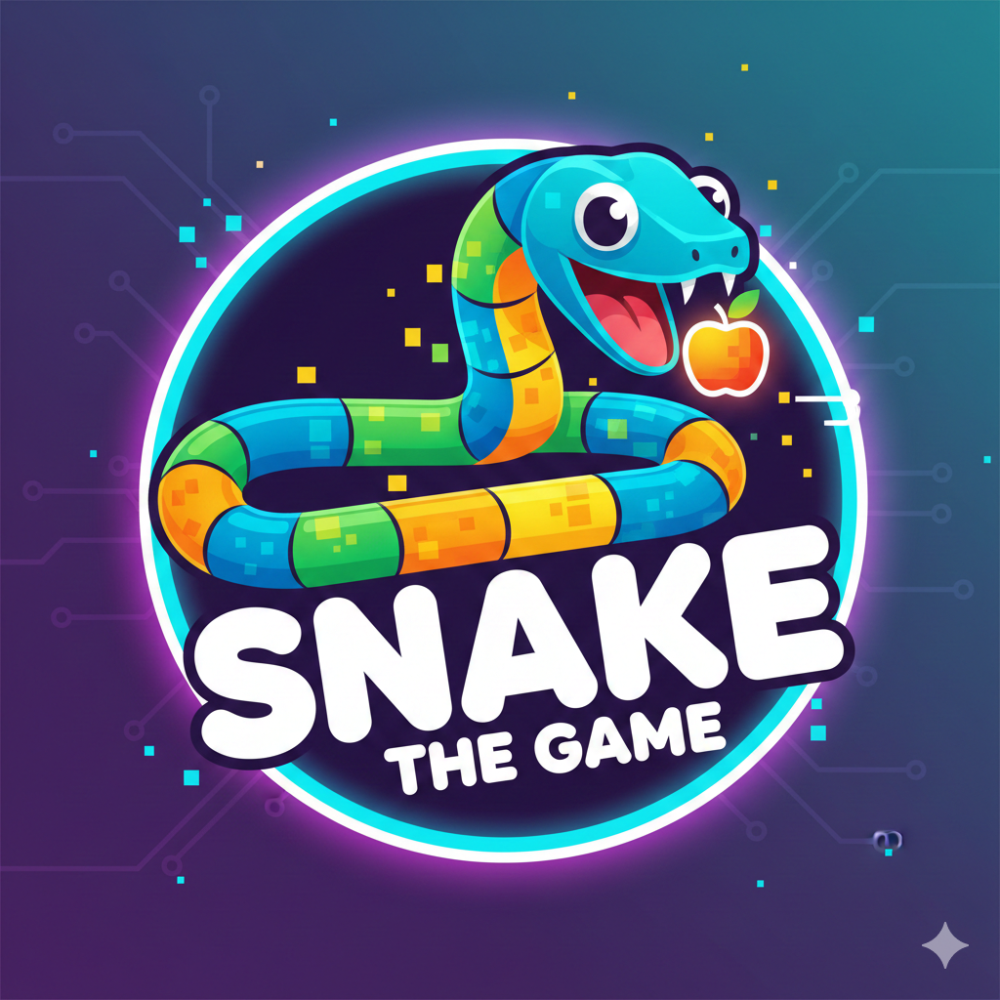

<div align="center"> 
     
    <h1><strong>My Snake Game</strong></h1> 
    <p>A modern Snake game built with React, Vite and TailwindCSS.</p> 
     
     
     
     
</div>

## 🐍 About the Project

My Snake Game is a modern remake of the classic Snake game, inspired by a Figma UI design and styled with TailwindCSS. It features smooth movement, clean UI, and high modularity.

+ Perfect for learning:
+ React state management
+ Game loop with intervals
+ Keyboard event handling
+ Modern UI with Tailwind
+ Component-driven development

## 🚀 Tech Stack

+ ⚛️ React.js (JSX)
+ ⚡ Vite
+ 🎨 TailwindCSS
+ 🔁 Custom Hooks
+ 🧮 Plain JavaScript utilities

## 📂 Project Structure
```
my-snake-game/
│
├── public/
│   ├── favicon.ico
│   └── snake-logo.png
│
├── src/
│   ├── assets/
│   │   └── …
│   │
│   ├── components/
│   │   ├── Board.jsx
│   │   ├── Controls.jsx
│   │   ├── GameOverModal.jsx
│   │   ├── GameStats.jsx
│   │   └── ui/
│   │       ├── Button.jsx
│   │       └── utils.jsx
│   │
│   ├── App.css
│   ├── App.jsx
│   ├── main.jsx
│   └── index.css
│
├── package.json
├── tailwind.config.js
├── vite.config.js
└── README.md
```

## 🎮 Controls

| Key | Action |
|-----------|--------|
| **Arrow Up** | Move up |
| **Arrow Down** | Move down |
| **Arrow Left** | Move left |
| **Arrow Right** | Move right |

## ▶️ Install and Run

```
git clone https://github.com/faidrn/my-snake-game
cd my-snake-game
npm install
npm run dev
```

## 🧭 Roadmap

- [x]  Snake movement
- [x]  Collision detection
- [x]  TailwindCSS UI
- [ ]  Sound effects
- [ ] Food and death animations
- [ ] Dark mode
- [ ] Snake skins
- [ ] Level system


 ## 🤝 Contributing

PRs are welcome!
Feel free to improve visuals, optimize logic, or add new features.

## 📄 License

Licensed under the MIT License.
